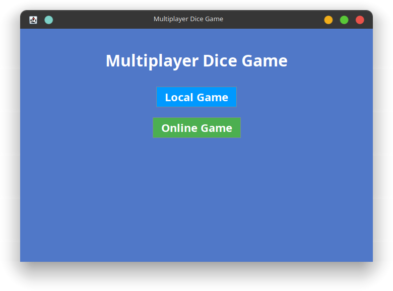
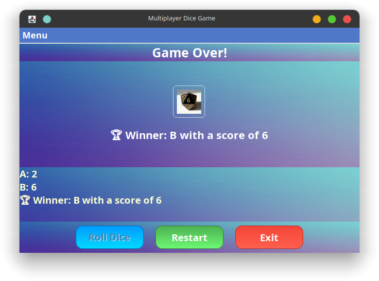
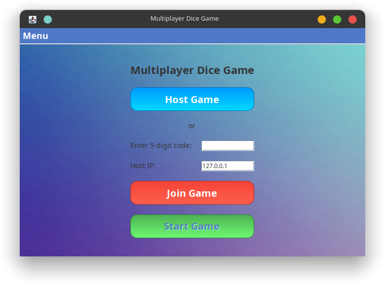
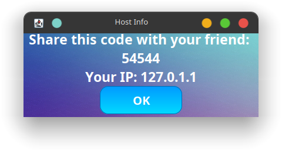

# 🎲 Multiplayer Dice Game

An interactive Java Swing game for 2 to 5 players. Each player takes turns rolling a dice, and the player(s) with the highest roll wins! The game features a modern UI, custom backgrounds, and easy controls.

---

## ✨ Features
- Local and Online multiplayer modes (host/join with code)
- Single window experience (no popups or extra frames)
- Menu bar to switch between local and online game modes
- Custom player names and winner display
- Modern, colorful UI with background image
- Dice images and smooth roll animation
- Custom-styled dialogs and prompts
- Restart and exit buttons
- No external dependencies (pure Java/Swing)

## 📦 Project Structure
```
multiplayer-dice-game
├── src
│   ├── Main.java
│   ├── gui
│   │   └── GameWindow.java
│   ├── game
│   │   ├── Dice.java
│   │   ├── Player.java
│   │   └── GameLogic.java
│   └── utils
│       └── Constants.java
├── resources
│   ├── background.jpg/png
│   ├── dice1.png
│   ├── dice2.png
│   ├── dice3.png
│   ├── dice4.png
│   ├── dice5.png
│   └── dice6.png
├── README.md
```

## 🚀 Getting Started

### Prerequisites
- Java Development Kit (JDK 8 or higher)
- Any Java IDE (IntelliJ IDEA, Eclipse, VS Code, etc.) or terminal

### Setup & Run
1. **Clone this repository:**
   ```sh
   git clone https://github.com/yourusername/multiplayer-dice-game.git
   cd multiplayer-dice-game
   ```
2. **Ensure resources are available:**
   - Place `background.jpg` (or `background.png`) and `dice1.png` to `dice6.png` in the `resources` folder.
3. **Compile the code:**
   ```sh
   cd src
   javac gui/Main.java gui/GameWindow.java gui/NetworkLobby.java game/Dice.java game/Player.java game/GameLogic.java utils/Constants.java
   ```
4. **Run the game:**
   ```sh
   java gui.Main
   ```
   *(On Windows, use `;` instead of `:` for the classpath, and run from the `src` folder)*

## 🕹️ How to Play
- **Local Game:**
  - Enter the number of players (2-5) and their names.
  - Each player clicks "Roll Dice" on their turn.
  - The result and winner (or draw) are displayed at the end.
  - Use "Restart" to play again or "Exit" to quit.
- **Online Game:**
  - Host: Click "Host Game" and share the code and IP with your friend.
  - Join: Enter the code and IP to join your friend's game.
  - Use the menu bar to switch between local and online modes at any time.

## 🖼️ Screenshots








## 📄 License
This project is open-source and available for modification and distribution. Enjoy the game!

---
